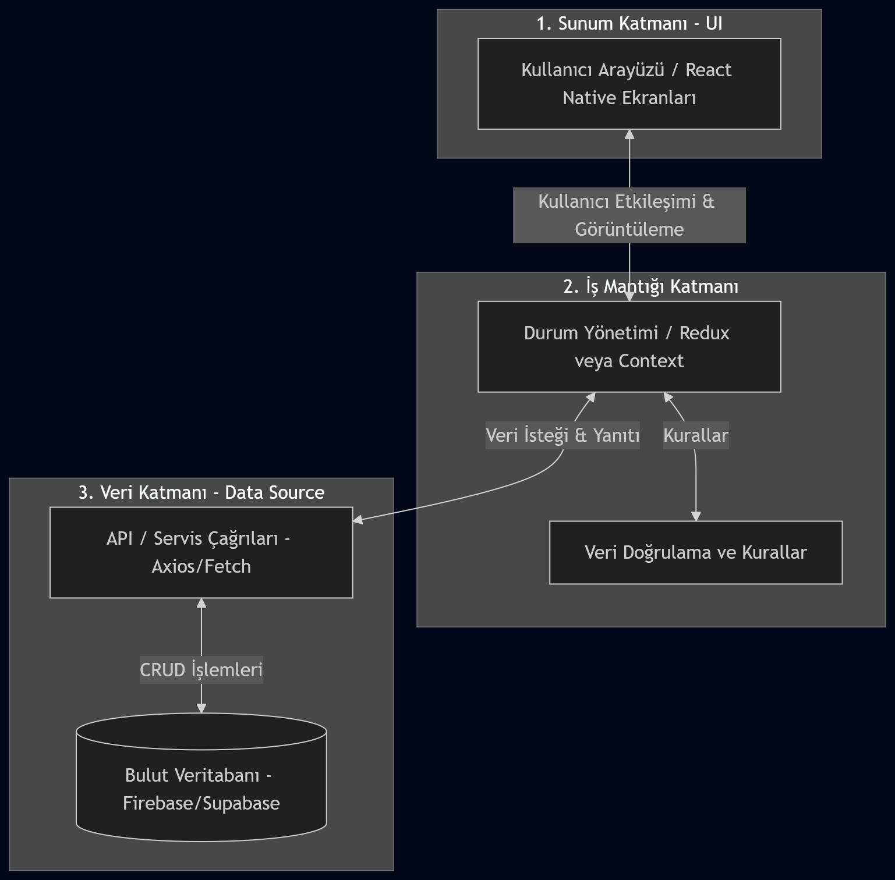
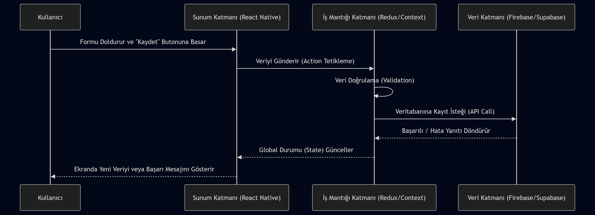

# Mimari Tasarım ve Veri Akışı Dokümanı

## 1. Mimari Bileşenlerin Belirlenmesi

LAB 5 (Teknoloji Seçimi) sonuçlarına göre uygulamayı oluşturan temel bileşenler şunlardır:

- **Kullanıcı Arayüzü (UI / Ekranlar):** Uygulamanın görsel kısımlarıdır. React Native / Expo kullanılarak geliştirilecek ekranlar (örn. Ana Ekran, Liste Ekranı, Ekleme/Düzenleme Formları). Kullanıcı etkileşimleri bu bileşen üzerinden alınır.
- **İş Mantığı (Uygulama Kuralları):** Uygulamanın beyni olarak çalışır. Durum yönetimi (State Management) için Redux Toolkit veya Context API kullanılır. Ekranlardan gelen eylemleri (action) işler, veri doğrulama yapar ve gerekli durumlarda veri kaynağına istek atar.
- **Veri Kaynağı (Veritabanı / API):** Firebase veya Supabase gibi bulut tabanlı veritabanı servislerini kapsar. Kullanıcı verilerinin güvenli, kalıcı ve eşzamanlı (real-time) olarak saklandığı yerdir.

---

## 2. Katmanlı Yapı (Layered Architecture)

Uygulamanın mimarisi, sorumlulukların birbirinden ayrılması amacıyla üç temel katmandan oluşmaktadır:

1. **Sunum Katmanı (Presentation Layer):** React Native bileşenlerini ve React Navigation ile ekranlar arası geçişleri içerir.
2. **İş Mantığı Katmanı (Business Logic Layer):** Redux Toolkit/Context API ve uygulama kurallarının yer aldığı katmandır.
3. **Veri Katmanı (Data Layer):** Firebase/Supabase ile iletişim kuran, HTTP/API isteklerini (Axios/Fetch) yöneten katmandır.

### Mimari Katmanlar Diyagramı

---

## 3. Veri Akışı

Kullanıcının uygulamada bir işlem (örneğin yeni bir kayıt ekleme) başlatması durumunda verinin nasıl aktığı adım adım aşağıda gösterilmiştir.

**Veri Akış Adımları:**
1. **İşlemin Başlatılması:** Kullanıcı arayüzde (UI) bir "Kaydet" veya "Ekle" butonuna basar.
2. **Action Tetiklenmesi:** Sunum Katmanı, İş Mantığı Katmanına (Durum Yönetimi) bu isteği iletir.
3. **Veri İşleme ve Doğrulama:** İş Mantığı Katmanında veri doğrulanır ve ağ isteğine (API call) dönüştürülür.
4. **Veritabanına İletim:** Veri Katmanı üzerinden Firebase/Supabase'e veritabanı işlemi (Ekleme/Güncelleme/Silme/Okuma) gönderilir.
5. **Yanıtın Alınması:** Veritabanından gelen başarı/hata durumu iş mantığı katmanına döner.
6. **UI'ın Güncellenmesi:** İş mantığı, yerel state'i günceller ve UI'da kullanıcının bu değişikliği (örn. listenin yenilenmesi, başarı mesajı vb.) görmesi sağlanır.

### Veri Akışı Diyagramı (Kullanıcı İşlemi Örneği)

---

## 4. Referans Özet

**Kurguide Mobil Uygulaması İçin Mimari Yapı:**
- **UI:** Ana ekran, Liste ekranı, Veri ekleme/düzenleme formları.
- **İş Mantığı:** Cross-platform veri senkronizasyonu kuralları, form doğrulama, Redux/Context state yönetimi.
- **Veri Kaynağı:** Firebase/Supabase bulut deposu üzerinden real-time veya asenkron olarak okuma/yazma (CRUD) operasyonları.
