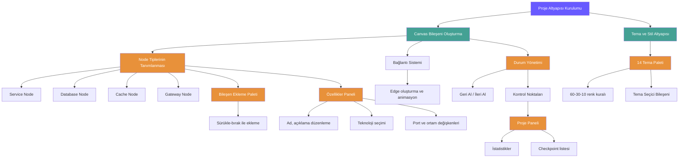
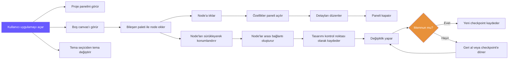
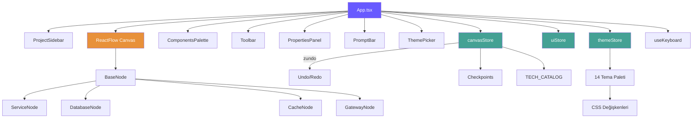

# Hafta 1 — İş Akış Diyagramı ve Belgeleme

**Proje:** Kurguide – Sistem Mimarisi Tasarım Aracı  
**Dönem:** Hafta 1  
**Tarih:** 03–09 Mart 2026

---

## 1. Geliştirme İş Akış Diyagramı

Aşağıdaki diyagram, Hafta 1 boyunca gerçekleştirilen geliştirme adımlarını ve bu adımlar arasındaki bağımlılıkları göstermektedir.



---

## 2. Kullanıcı Etkileşim Akışı

Kullanıcının uygulama içindeki temel etkileşim akışını gösteren diyagram:



---

## 3. Uygulama Bileşen Mimarisi

Hafta 1 sonunda uygulamanın bileşen yapısını gösteren diyagram:



---

## 4. Dosya Yapısı

```
apps/web/src/
├── App.tsx                    # Ana uygulama bileşeni
├── index.css                  # Global stiller ve CSS değişkenleri
├── components/
│   ├── ProjectSidebar.tsx     # Sol panel (proje bilgileri, checkpoint)
│   ├── ComponentsPalette.tsx  # Bileşen ekleme paleti
│   ├── Toolbar.tsx            # Geri al / İleri al / Checkpoint kaydet
│   ├── PropertiesPanel.tsx    # Node özellik düzenleme paneli
│   ├── PromptBar.tsx          # AI metin girişi (Hafta 2'de aktif)
│   ├── ThemePicker.tsx        # Tema seçici
│   └── nodes/
│       ├── index.ts           # Node tipleri tanımları
│       ├── BaseNode.tsx       # Ortak node bileşeni
│       ├── ServiceNode.tsx    # Servis node'u
│       ├── DatabaseNode.tsx   # Veritabanı node'u
│       ├── CacheNode.tsx      # Önbellek node'u
│       └── GatewayNode.tsx    # Gateway node'u
├── store/
│   ├── canvasStore.ts         # Canvas durumu, node/edge yönetimi
│   ├── uiStore.ts             # Seçili node, panel durumu
│   └── themeStore.ts          # 14 tema paleti, tema uygulama
├── hooks/
│   └── useKeyboard.ts         # Ctrl+Z / Ctrl+Y kısayolları
└── tailwind.config.js         # Tailwind renk ve tema yapılandırması
```

---

## 5. Kullanılan Teknolojiler

| Teknoloji | Kullanım Alanı |
|-----------|---------------|
| React 18 | Kullanıcı arayüzü |
| TypeScript | Tip güvenliği |
| Vite | Geliştirme sunucusu ve derleme |
| React Flow | Görsel canvas ve node yönetimi |
| Zustand | Durum yönetimi |
| zundo | Geri al / ileri al geçmişi |
| Tailwind CSS | Stil ve tema sistemi |
| pnpm | Paket yönetimi (monorepo) |
